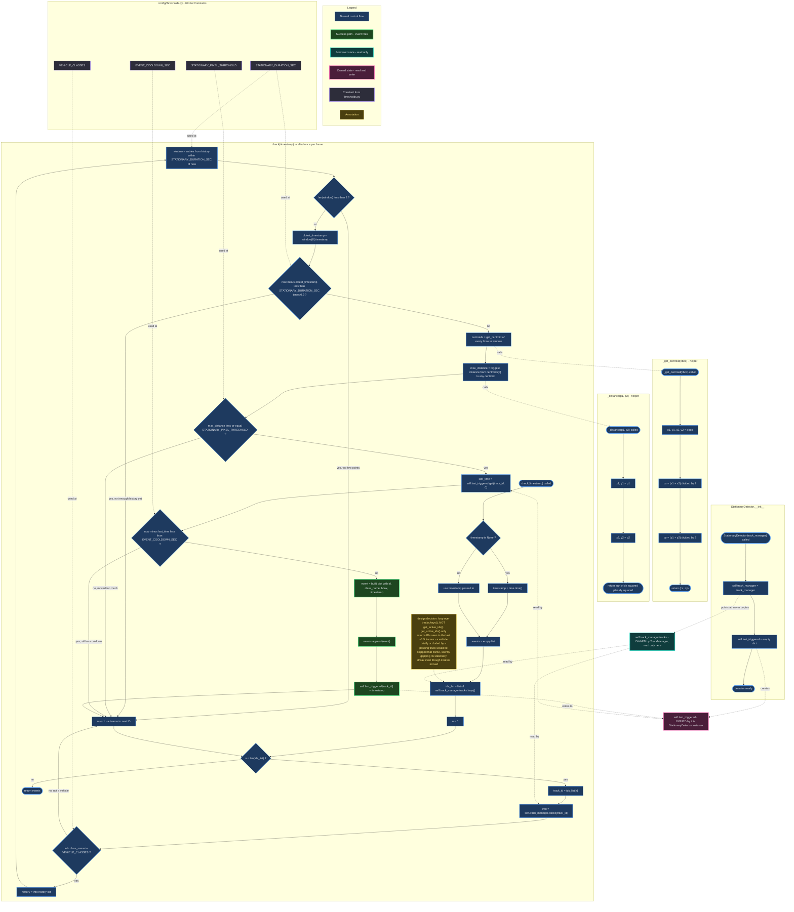

# `src/analytics/stationary.py` — `StationaryDetector` Flowchart

## What's different about this one

`ingestion.py` was two threads racing over shared memory. `tracker.py`
was sequential logic building up a shared dictionary. This file is
neither — it's almost entirely **guard clauses**. Four separate "this
vehicle doesn't qualify, move to the next one" exits, and only ONE
narrow path that actually survives all four gates and fires an event.

That shape — mostly red skip-paths, one thin green success-path — is
the whole personality of this function, and it's worth being able to
see that at a glance, not just read it top to bottom.

The other thing worth seeing explicitly: this file **borrows** state
(`self.track_manager.tracks`, owned by `TrackManager`, read-only from
here) but also **owns** its own private state (`self.last_triggered`,
created and only ever touched by this class). Two different kinds of
"memory," two different colors.

| Color | Meaning |
|---|---|
| Blue | Normal control flow |
| Green | The success path — an event actually gets built and fired |
| Teal | `self.track_manager.tracks` — borrowed, read-only here |
| Magenta | `self.last_triggered` — owned by this class, read AND written here |
| Purple | Constant from `config/thresholds.py` |
| Amber | Annotation — a design decision, not a step |

## Points worth being able to answer out loud

1. **Count the exits into `C25`.** Four separate reasons converge on
   the exact same "move to next ID" node: not a vehicle, not enough
   history points, history not old enough yet, moved too far. That's
   the visual proof of "mostly guard clauses" — four different doors,
   all leading to the same hallway.

2. **`BORROWED_TRACKS` has two arrows going *into* `C6` and `C10`, and
   zero arrows coming *out* of this file back into it.** This module
   never mutates `self.track_manager.tracks` — only `TrackManager.update()`
   does that. If you ever caught yourself writing
   `self.track_manager.tracks[track_id] = something` inside
   `stationary.py`, that would be a real design violation worth
   catching — it would mean this module secretly started owning state
   it's only supposed to borrow.

3. **The design-decision note (`CNOTE`) attaches to `C6`, not to a
   later node**, because the decision is made the moment you choose
   *which* iterable to loop over — everything downstream just follows
   from that one choice. If Ankit sir asks "why not just filter for
   active tracks first," this is the node to point at.

4. **Notice what `C13`'s window filter does NOT do**: it doesn't check
   whether the history is *continuous* — just whether each entry's
   timestamp falls within the last `STATIONARY_DURATION_SEC`. If a
   vehicle was seen at `t=1s`, occluded, then reappeared at `t=4.8s`,
   both points land in the same window, and the max-distance check
   would treat them as adjacent even though 3.8 seconds of unknown
   movement happened in between. Is that a bug, or is it fine given
   what "stationary" is trying to measure? Worth having an answer
   ready — I'd genuinely like to hear your take before I give mine.

---

*Once you've opened this in Obsidian: does `CNOTE` (the design-decision
annotation) render and connect visibly to `C6`? That's the node most
likely to get visually lost given how many arrows converge on this
subgraph — good thing to double check.*
