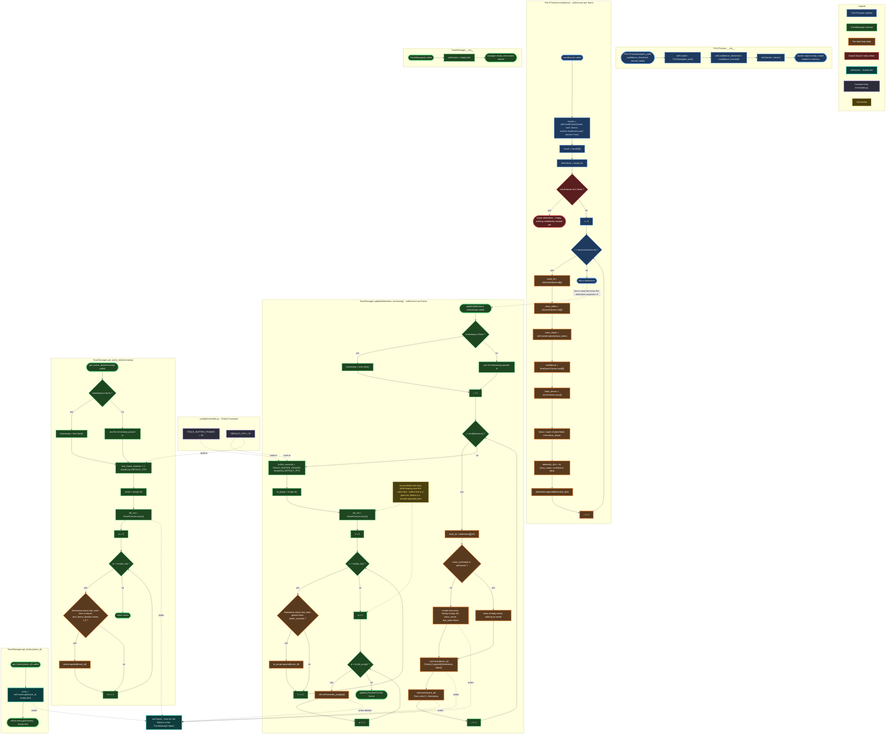

# `src/tracker.py` — `YOLOTracker` + `TrackManager` Flowchart

## How this one differs from `ingestion.py`

No threads here. No lock. Everything in this file runs on whichever
thread calls it, one call at a time, in sequence — `YOLOTracker.track()`
gets called once per frame by your main loop, and its return value
(`detections`) is immediately handed to `TrackManager.update()`. There
is no background worker quietly running in parallel.

What *is* shared, though, is `self.tracks` inside `TrackManager` — one
dictionary that `update()` writes to and `get_active_ids()` /
`get_history()` read from, persisting **across every call**, for the
entire lifetime of the object. That persistence is the whole reason
this class exists — without it, every module downstream would have to
remember tracking history itself, and they'd inevitably disagree.

| Color | Meaning |
|---|---|
| Blue | `YOLOTracker` methods |
| Green | `TrackManager` methods |
| Orange | The part of a loop that runs **once per item**, not once per frame |
| Red | Guard clause / early return |
| Teal | `self.tracks` — the persistent shared dictionary itself |
| Purple | Constants imported from `config/thresholds.py` |
| Amber | Annotation — a "why," not a step |

## Points worth being able to explain out loud

1. **Why is there no lock anywhere in this file, when `ingestion.py`
   was full of them?** Because `ingestion.py` genuinely has two
   threads racing over the same variable. `tracker.py` assumes it is
   only ever called from one place, sequentially — your main loop
   calls `track()`, then immediately calls `update()` with that
   result, then moves to the next frame. Nothing runs concurrently
   with `self.tracks` being mutated. If you ever changed that
   assumption (e.g. ran inference on a separate thread from the main
   display loop), `TrackManager` would need the exact same locking
   treatment `VideoIngestion` has. Good "what would break this"
   question to be ready for.

2. **The two-pass purge (`MU16`→`MU21` collect, then `MU22`→`MU25`
   delete) is a genuine Python constraint, not a style choice.**
   Mutating a dict's size while iterating over it with `.items()`
   raises `RuntimeError: dictionary changed size during iteration`.
   The annotation node (`MUNOTE`, amber) is there specifically because
   this is exactly the kind of thing an interviewer asks you to
   explain: "why not just delete inline as you find it?"

3. **`YT18 -.-> MU1`** is the one edge that shows how these two
   classes are meant to be wired together in `main.py`, even though
   neither class imports or calls the other directly. `YOLOTracker`
   doesn't know `TrackManager` exists, and vice versa — the contract
   between them is just "a list of dicts shaped like `{id, class_name,
   confidence, bbox}` flows from one to the other." That's a
   deliberate decoupling: you could swap in a different tracker
   entirely and `TrackManager` wouldn't need to change, as long as it
   still hands over dicts in that shape.

---

*No ` ` tags, no emoji glyphs anywhere in this file's node labels —
both caused silent text loss in your Excalidraw export of the previous
diagram. If this one renders clean end-to-end, that confirms the
theory; if something's still missing, tell me exactly which node so we
can narrow down the real cause.*
