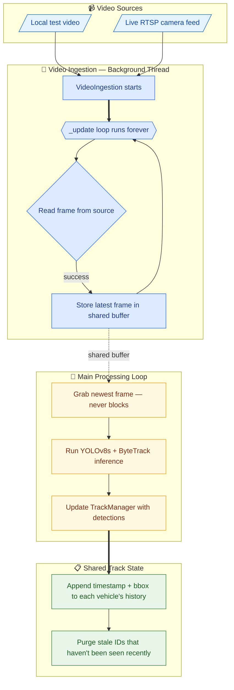
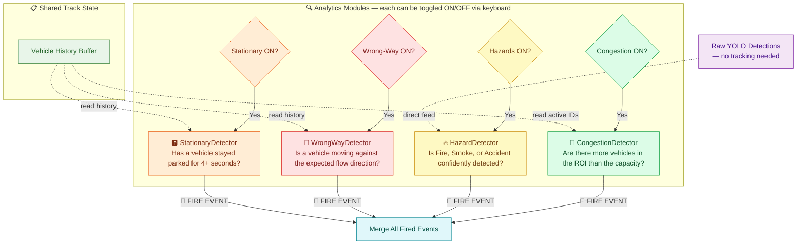
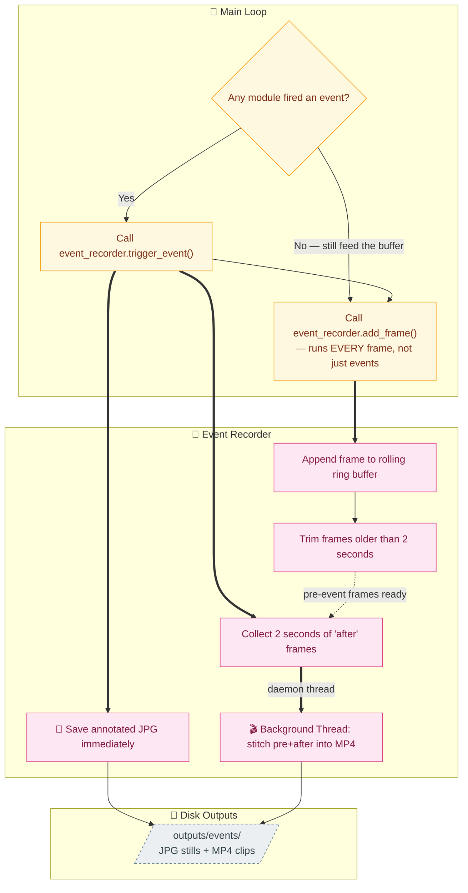
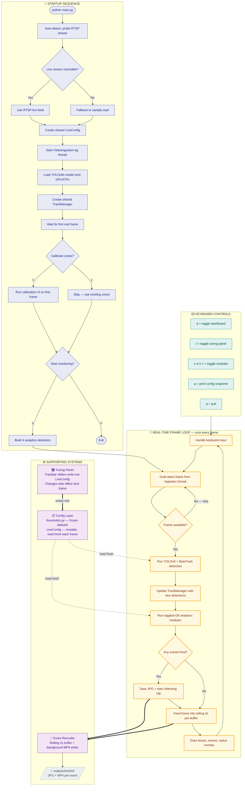
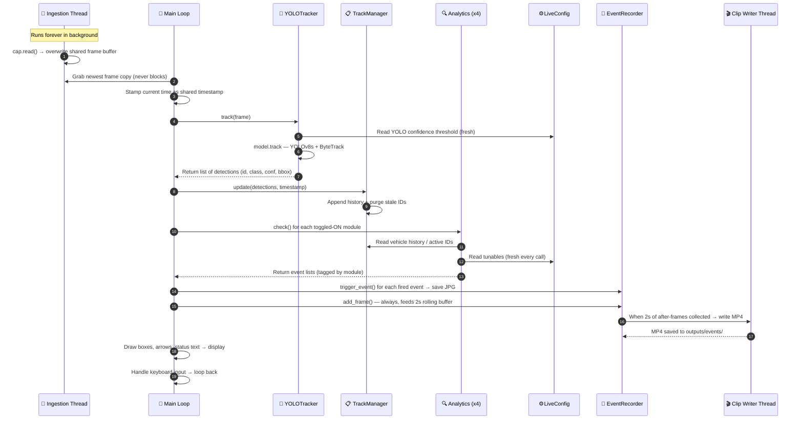

# Traffic Analysis YOLO Project — Architecture & Flowcharts

This document breaks down the system architecture of the real-time YOLOv8 traffic monitoring pipeline. The architecture is presented **piece-by-piece**, building up from individual components to the complete system.

> **How to read these diagrams on GitHub:** GitHub renders Mermaid diagrams with built-in zoom & pan controls (a small widget appears in the corner). For the smaller diagrams below, you likely won't need them — but they're there for the larger ones.

---

## 1. Data Ingestion & Tracking Pipeline

The system starts by ingesting video frames in a **background thread** to prevent blocking. The main loop grabs the latest frame, runs YOLOv8 + ByteTrack to detect and track objects, and stores the results in a shared `TrackManager`.

**What's happening here:**
- A **daemon thread** continuously reads frames from the video source and stores the latest one in a thread-safe buffer.
- The **main loop** grabs a copy of the latest frame (never waits), runs YOLO detection + ByteTrack tracking, and feeds the results into the `TrackManager`.
- The `TrackManager` keeps a history of every tracked vehicle's position over time, and cleans up old IDs that disappeared.

---

## 2. Analytics Modules

Once the `TrackManager` is updated, the data is passed to **four independent analytics modules**. Each module watches for a different traffic condition. Three modules read from the `TrackManager`'s vehicle history; the **Hazard** module is different — it reads raw YOLO detections directly because fire/smoke/accident have no stable identity to track.

**What's happening here:**
- Each module can be **toggled ON or OFF** at runtime using keyboard keys (`s`, `w`, `h`, `c`). When a module is OFF, its `check()` is never called — saving compute.
- **Stationary** checks if a vehicle's centroid has barely moved over a time window.
- **Wrong-Way** computes the cosine similarity between a vehicle's trajectory and the expected flow direction — negative = going against traffic.
- **Hazard** uses a flicker-tolerant persistence check: it requires 3 confident detections out of the last 5 frames before firing, so brief false positives don't trigger events.
- **Congestion** simply counts vehicles inside a defined polygon and compares against a capacity threshold.

---

## 3. Event Recorder & Output

When any analytics module fires an event, the system immediately records it. A **rolling pre-event buffer** ensures we always have the 2 seconds of video *before* the event occurred, and a background thread writes the resulting `.mp4` clip and `.jpg` still to disk without blocking the main loop.

**What's happening here:**
- `add_frame()` runs on **every single frame**, feeding a rolling 2-second ring buffer. This way, when an event fires, the "before" footage already exists.
- `trigger_event()` saves the annotated JPG **immediately**, then starts collecting 2 seconds of "after" frames.
- Once the after-window is full, a **daemon thread** stitches pre + after frames into an MP4 clip and writes it to disk — the main loop never blocks on I/O.

---

## 4. Complete System Overview

This diagram shows **the entire system in one view** — from startup to the real-time processing loop. It is a simplified, readable version that focuses on the *flow of data* rather than individual function signatures.

<!--
HOW TO READ THIS DIAGRAM:
- Solid arrows (→) = control flow / data flow
- Thick arrows (⇒) = object construction or thread spawn
- Dotted arrows (⇢) = config/data reads
- Colors match the subsystem: amber=main, blue=ingestion, green=tracking, 
  orange/red/yellow/green=analytics, pink=recorder, purple=config, cyan=tuning
-->

**How to read this diagram:**
- **🚀 Startup Sequence (top):** The program auto-detects whether a live RTSP stream is available. If not, it falls back to a test video file. It then loads the YOLO model, waits for the first frame, optionally runs the zone calibration tool, and builds all analytics modules.
- **🔁 Frame Loop (middle):** Every frame goes through: grab → detect → track → analyze → record → draw → handle keys → repeat.
- **⚙️ Supporting Systems (right):** The config layer provides thresholds that are read fresh every frame. The tuning panel writes directly into `LiveConfig` so changes are instant. The event recorder runs its own background thread for disk I/O.
- **⌨️ Keyboard Controls (bottom):** All module toggles and display controls are handled via single-key presses.

---

## 5. One-Frame Lifecycle (Runtime Sequence)

This sequence diagram shows the **exact order of operations** within a single frame — which component calls which, and what data flows between them.

---

## Color Legend

| Color | Subsystem |
|---|---|
| 🟦 Blue | `src/ingestion.py` — VideoIngestion threaded capture |
| 🟨 Amber | `main.py` — entry point, startup, real-time loop |
| 🟩 Green | `src/tracker.py` — YOLOTracker + TrackManager |
| 🟧 Orange | `src/analytics/stationary.py` |
| 🟥 Red | `src/analytics/wrong_way.py` |
| 🟡 Yellow | `src/analytics/hazards.py` |
| 💚 Green | `src/analytics/congestion.py` |
| 🩷 Pink | `src/event_recorder.py` |
| 🟪 Purple | `config/` — thresholds.py + LiveConfig |
| 🩵 Cyan | `src/tuning_panel.py` |

**Edge styles:** thick `==>` = object construction or thread spawn · thin `-->` = control/data flow · dotted `-.->` = config/data read.
