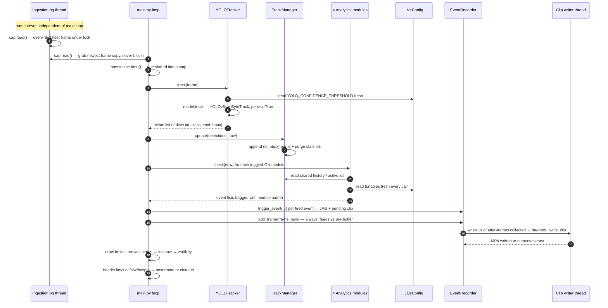

# Traffic Analysis YOLO Project — Complete Architecture Flowchart

Hyper-detailed Mermaid flowchart of the whole pipeline:
`ingestion → YOLOv8s+ByteTrack tracker → shared TrackManager → 4 analytics modules → threaded event_recorder → OpenCV display`,
plus the live-tuning system (LiveConfig + TuningPanel), the config layer, and the offline zone-calibration tool.

Every class, every function/method, and every meaningful decision branch in every file is a node.
Colors: one color per subsystem (see the legend at the bottom).

## Diagram 1 — Master flowchart (every file, function, class, branch)

```mermaid
flowchart TD

%% ═════════════════════ EXTERNAL WORLD ═════════════════════
subgraph EXT["EXTERNAL INPUTS and OUTPUTS"]
direction LR
    X_FILE[/"data/test_footage/sample.mp4<br>local test video"/]
    X_RTSP[/"rtsp://127.0.0.1:8554/mystream<br>live RTSP camera feed"/]
    X_WEIGHTS[/"models/weights/new_best.pt<br>custom YOLOv8s 10-class weights<br>trained at imgsz 960"/]
    X_USER(["USER KEYBOARD<br>d t s w h c p q"])
    X_WIN[/"OpenCV HighGUI windows<br>Traffic Dashboard + Tuning Panel"/]
    X_OUT[/"outputs/events/<br>JPG stills + MP4 clips"/]
end

%% ═════════════════════ CONFIG LAYER ═════════════════════
subgraph CFG["config/ — CONFIGURATION LAYER"]
direction TB
    subgraph CFG_TH["config/thresholds.py — frozen startup constants"]
    direction TB
        CFG_YOLO["MODEL_IMGSZ = 960<br>YOLO_CONFIDENCE_THRESHOLD = 0.4"]
        CFG_ING["DEFAULT_FPS = 25<br>RECONNECT_MAX_RETRIES = 5<br>RECONNECT_DELAY_SEC = 1"]
        CFG_TRK["TRACK_BUFFER_FRAMES = 30"]
        CFG_STA["STATIONARY_DURATION_SEC = 5<br>STATIONARY_PIXEL_THRESHOLD = 15<br>STATIONARY_AREA_CHANGE_THRESHOLD = 0.25"]
        CFG_WW["WRONG_WAY_DURATION_SEC = 5<br>WRONG_WAY_SMOOTHING_WINDOW = 10<br>WRONG_WAY_COSINE_THRESHOLD = -0.3<br>WRONG_WAY_ZONES 2 polygons + flow vectors<br>WRONG_WAY_DEFAULT_FLOW_VECTOR"]
        CFG_HAZ["HAZARD_CONFIDENCE_THRESHOLD = 0.25<br>HAZARD_PERSISTENCE_SEC = 1<br>flicker rule: 3 confident of last 5 frames"]
        CFG_CON["CONGESTION_CAPACITY = 5<br>CONGESTION_ROI_POLYGON_NORM"]
        CFG_EVT["PRE_EVENT_SEC = 2, POST_EVENT_SEC = 2<br>EVENT_COOLDOWN_SEC = 2<br>HAZARD_EVENT_COOLDOWN_SEC = 30"]
        CFG_TAX["taxonomy — VEHICLE_CLASSES Car Bike Bus Truck<br>HAZARD_CLASSES Fire Smoke Accident<br>DETECTION_ONLY_CLASSES Animal Obj_On_Road<br>DEBUG flag"]
    end
    CFG_LC["config/live_config.py — class LiveConfig<br>init seeds 9 mutable thresholds from thresholds.py<br>ONE shared instance read FRESH every frame<br>snapshot returns dict of current values"]
end

%% ═════════════════════ MAIN ═════════════════════
subgraph MAIN["main.py — ENTRY POINT and REAL-TIME LOOP"]
direction TB

    subgraph MAIN_SU["startup — pieces 0 to 2"]
    direction TB
        M_START(["python main.py → main()"])
        M_INPUT["input prompt: type file or live"]
        M_CHOICE{"source_choice == live?"}
        M_SRC_LIVE["SOURCE = rtsp URL"]
        M_SRC_FILE["SOURCE = sample.mp4"]
        M_CFG["PIECE 0: config = LiveConfig()<br>ONE shared instance for everything"]
        M_CAP["PIECE 1: cap = VideoIngestion(SOURCE).start()<br>background reader thread begins"]
        M_TRK["tracker = YOLOTracker(WEIGHTS, config)<br>model fully loaded at init"]
        M_TM["track_manager = TrackManager()<br>single source of truth for track state"]
        M_PRIME{"prime loop: first_frame = cap.read()<br>still None?"}
        M_SLEEP["time.sleep 0.05 — do not spin CPU"]
        M_DIMS["frame_height, frame_width = first_frame.shape"]
        M_SD["stationary_detector =<br>StationaryDetector(track_manager, config)"]
        M_WD["wrong_way_detector =<br>WrongWayDetector(track_manager, config, w, h)"]
        M_HD["hazard_detector = HazardDetector(config)<br>NO track_manager — raw detections only"]
        M_CD["congestion_detector =<br>CongestionDetector(track_manager, w, h, config)"]
        M_ER["event_recorder = EventRecorder()"]
        M_WINSET["PIECE 2: namedWindow Traffic Dashboard 320x80<br>module_state all ON<br>dashboard_visible = False, panel_visible = False"]
    end

    subgraph MAIN_LOOP["pieces 3 to 7 — while True real-time loop"]
    direction TB
        M_LOOP{{"TOP OF LOOP — every frame"}}
        M_READ["frame = cap.read()<br>never blocks"]
        M_NONE{"frame is None?"}
        M_NOW["PIECE 4: now = time.time()<br>ONE shared timestamp per frame"]
        M_TRACK["detections = tracker.track(frame)"]
        M_TMUPD["track_manager.update(detections, now)"]
        M_INIT_EV["PIECE 5: all 4 event lists start as empty list<br>so OFF looks identical to fired-nothing"]
        M_GATE_S{"module_state stationary ON?"}
        M_CALL_S["stationary_events = stationary_detector.check(now)<br>tag each event module = stationary"]
        M_GATE_W{"module_state wrong_way ON?"}
        M_CALL_W["wrong_way_events = wrong_way_detector.check(now)<br>tag module = wrong_way"]
        M_GATE_H{"module_state hazards ON?"}
        M_CALL_H["hazard_events = hazard_detector.check(detections, now)<br>only module fed RAW detections<br>tag module = hazard"]
        M_GATE_C{"module_state congestion ON?"}
        M_CALL_C["congestion_events = congestion_detector.check(now)<br>tag module = congestion"]
        M_MERGE["PIECE 6: all_events = concat of the 4 lists"]
        M_ANYEV{"for each fired event"}
        M_TRIGGER["event_recorder.trigger_event<br>frame, now, event_type = module, metadata = event"]
        M_ADDF["event_recorder.add_frame(frame, now)<br>EVERY frame — feeds the rolling pre-event tape"]
        M_DRAW["PIECE 7: draw green bbox + label per detection<br>yellow motion arrow from history minus-5 centroid<br>status text overlay S W H C D T"]
        M_SHOWQ{"dashboard_visible?"}
        M_RESIZE["resize_frame_for_display max 1280x720<br>cv2.imshow"]
        M_KEY["key = cv2.waitKey(1) — 1ms pause,<br>repaints window, captures keypress"]
        M_QUITQ{"should_quit? q pressed<br>or window closed"}
        M_KEYS{"dispatch other keys"}
        M_K_TOG["s w h c → toggle_module_state<br>flips that module ON or OFF"]
        M_K_P["p → print_tuning_snapshot(config)<br>paste-ready dump for thresholds.py"]
        M_K_D["d → toggle dashboard visibility<br>resize window 1280x720 or 320x80"]
        M_K_T["t → create TuningPanel(config)<br>or destroy panel window"]
        M_CLEAN["CLEANUP: cap.stop()<br>cv2.destroyAllWindows()"]
        M_END(["program exit"])
    end

    subgraph MAIN_HELP["module-level helper functions"]
    direction TB
        MH_TOG["toggle_module_state(state, key)<br>KEY_TOGGLE_MAP lookup, flip bool"]
        MH_STAT["build_status_text(state, dash, panel)<br>S:ON W:ON H:ON C:ON D:OFF T:OFF"]
        MH_SNAP["print_tuning_snapshot(config)<br>loops config.snapshot()"]
        MH_QUIT["should_quit(key, window)<br>q key or WND_PROP_VISIBLE below 1"]
        MH_RSZ["resize_frame_for_display(frame)<br>scale to fit 1280x720, INTER_AREA"]
    end
end

%% ═════════════════════ INGESTION ═════════════════════
subgraph ING["src/ingestion.py — class VideoIngestion"]
direction TB
    I_INIT["init(source, loop_file = True)<br>detect is_rtsp / is_file,<br>frame = None, threading.Lock,<br>running = False, thread = None"]
    I_NORM["_normalize_source static<br>fixes rstp:// typo → rtsp://"]
    I_OPEN["_open_capture()<br>RTSP → force TCP transport + CAP_FFMPEG<br>file or webcam → plain VideoCapture<br>raises RuntimeError if not opened<br>file → compute per-frame interval from FPS"]
    I_START["start()<br>open capture, running = True,<br>spawn DAEMON thread running _update,<br>return self for chaining"]
    I_UPD{{"_update() — BACKGROUND THREAD<br>while running"}}
    I_RETQ{"ret, frame = cap.read()<br>success?"}
    I_EOFQ{"local file at EOF and<br>loop_file is False?"}
    I_RCOUNT["retries += 1"]
    I_MAXQ{"retries above RECONNECT_MAX_RETRIES?"}
    I_DEAD["running = False → thread exits<br>read() will now return None"]
    I_WAIT["sleep RECONNECT_DELAY_SEC<br>release capture"]
    I_REOPEN["try _open_capture again<br>except RuntimeError → continue retry loop<br>THE FROZEN-FRAME BUG FIX"]
    I_OK["retries = 0"]
    I_THROT["local file only: sleep remainder of<br>source_frame_interval — plays at real FPS"]
    I_LOCKW["with lock: self.frame = frame<br>overwrite shared latest-frame buffer"]
    I_READ["read() — consumer side, never blocks<br>with lock: return frame.copy()<br>returns None if running is False<br>no stale-frame serving after thread death"]
    I_STOP["stop()<br>running = False, thread.join(),<br>cap.release()"]
    I_CTX["enter / exit — context manager<br>wraps start and stop"]
end

%% ═════════════════════ TRACKER ═════════════════════
subgraph TRK["src/tracker.py — detection + shared track state"]
direction TB
    subgraph TRK_Y["class YOLOTracker"]
    direction TB
        T_INIT["init(weights_path, config, device = cpu,<br>imgsz = MODEL_IMGSZ 960)<br>self.model = YOLO(weights) — loads .pt now"]
        T_TRACK["track(frame)<br>model.track imgsz 960, persist = True,<br>tracker = bytetrack.yaml, verbose = False,<br>conf read FRESH from config each call"]
        T_GUARD{"result.boxes.id is None?<br>ByteTrack has zero confirmed tracks"}
        T_EMPTY["return empty list"]
        T_LOOP["loop by index i over parallel arrays<br>id, cls, conf, xyxy stay matched"]
        T_DICT["build plain dict per detection<br>id int, class_name via model.names,<br>confidence float, bbox tuple of floats"]
        T_RET["return detections<br>clean safe list — no tensors downstream"]
    end
    subgraph TRK_M["class TrackManager — shared source of truth"]
    direction TB
        TM_INIT["init — self.tracks = empty dict<br>id → history list, class_name, last_seen"]
        TM_UPD["update(detections, timestamp)<br>called ONCE per frame"]
        TM_NEWQ{"track_id seen before?"}
        TM_MK["create new entry with empty history"]
        TM_APP["append timestamp + bbox to history<br>stamp last_seen = now"]
        TM_PURGE["purge pass: buffer_seconds =<br>TRACK_BUFFER_FRAMES / DEFAULT_FPS<br>collect stale ids FIRST, then delete<br>never mutate dict mid-iteration"]
        TM_ACT["get_active_ids(ts)<br>only ids seen within 1.5 frame-durations<br>what is visible RIGHT NOW"]
        TM_HIST["get_history(id)<br>returns empty list if unknown — never None"]
    end
end

%% ═════════════════════ GEOMETRY ═════════════════════
subgraph GEO["src/geometry.py — shared polygon helpers"]
direction TB
    G_DEN["denormalize_polygon(norm, w, h)<br>0-1 coords → np.int32 pixel array<br>converted ONCE per polygon, not per frame"]
    G_PIP["point_in_polygon(point, polygon_px)<br>cv2.pointPolygonTest above 0 = inside"]
end

%% ═════════════════════ ANALYTICS ═════════════════════
subgraph ANA["src/analytics/ — THE FOUR ANALYTICS MODULES"]
direction TB

    subgraph STA["stationary.py — class StationaryDetector"]
    direction TB
        S_INIT["init(track_manager, config)<br>currently_stationary = empty dict<br>id → anchor centroid + anchor area"]
        S_CENT["_get_centroid(bbox)"]
        S_DIST["_distance(p1, p2) — Pythagoras"]
        S_CHECK["check(timestamp) — once per frame"]
        S_TUNE["read 3 live tunables once per call<br>duration, pixel threshold, area threshold"]
        S_STALE["drop anchors whose id vanished<br>from TrackManager"]
        S_LOOPQ{"for id in tracks.keys()<br>includes occluded ids — deliberate"}
        S_VEHQ{"class_name in VEHICLE_CLASSES?"}
        S_WIN["window = history entries within<br>last STATIONARY_DURATION_SEC"]
        S_DBG["DEBUG-gated diagnostic print"]
        S_G1Q{"at least 2 points in window?"}
        S_G2Q{"oldest point at least 90 percent<br>of duration old? grace rule"}
        S_CALC["max centroid drift from window start<br>+ max bbox-area ratio change<br>catches toward-camera depth motion"]
        S_ANCQ{"id already fired —<br>in currently_stationary?"}
        S_MOVQ{"moved beyond pixel threshold from ANCHOR<br>or area changed beyond 25 percent?"}
        S_CLR["incident over →<br>delete anchor, can re-fire later"]
        S_STILLQ{"drift within pixel threshold AND<br>area change within threshold?"}
        S_FIRE["FIRE ONCE per incident<br>event id, class, bbox, timestamp<br>anchor current centroid + area"]
        S_RET["return events"]
    end

    subgraph WW["wrong_way.py — class WrongWayDetector"]
    direction TB
        W_INIT["init(tm, config, w, h)<br>denormalize every WRONG_WAY_ZONE once<br>last_triggered + wrong_way_since empty dicts"]
        W_HELP["_get_centroid, _dot_product,<br>_vector_length, _cosine_similarity<br>zero-length guard returns 0.0 neutral"]
        W_FLOW["_expected_flow_for(centroid)<br>first zone containing point wins<br>fallback WRONG_WAY_DEFAULT_FLOW_VECTOR"]
        W_CHECK["check(timestamp)"]
        W_TUNE["read duration + cosine tunables"]
        W_LOOPQ{"for id in tracks.keys()"}
        W_VEHQ{"class_name in VEHICLE_CLASSES?"}
        W_WIN["window = last 10 history entries<br>COUNT-based smoothing, not time-based"]
        W_G1Q{"at least 2 points?"}
        W_T["trajectory vector T =<br>last centroid minus first centroid"]
        W_COS["cosine = cos angle between<br>T and this zone's flow vector"]
        W_NEGQ{"cosine below -0.3 —<br>clearly opposite flow?"}
        W_CLOCK["start or continue streak<br>wrong_way_since id = first violation time"]
        W_DURQ{"continuous streak at least<br>WRONG_WAY_DURATION_SEC?"}
        W_COOLQ{"EVENT_COOLDOWN_SEC passed<br>since last fire for this id?"}
        W_FIRE["FIRE event id, class, bbox,<br>timestamp, cosine"]
        W_RESET["streak broken →<br>wrong_way_since.pop id<br>continuous means continuous"]
        W_RET["return events"]
    end

    subgraph HAZ["hazards.py — class HazardDetector"]
    direction TB
        H_INIT["init(config) — NO TrackManager<br>hazards have no stable identity<br>hazard_since, last_triggered empty dicts<br>recent_presence per hazard class"]
        H_REM["_remember_presence(cls, seen)<br>rolling bool list capped at 5 frames"]
        H_FLK["_is_present_despite_flicker(cls)<br>at least 3 True of last 5?"]
        H_CHECK["check(detections, timestamp)<br>works on RAW per-frame detections"]
        H_TUNE["read confidence + persistence tunables"]
        H_STEPA["STEP A: seen_this_frame =<br>hazard-class detections with<br>conf at least threshold 0.25"]
        H_STEPBQ{"STEP B: for cls in<br>Fire, Smoke, Accident"}
        H_PRESQ{"present despite flicker?"}
        H_CLOCK["start or continue hazard_since cls"]
        H_DURQ{"persisted at least<br>HAZARD_PERSISTENCE_SEC?"}
        H_COOLQ{"HAZARD_EVENT_COOLDOWN_SEC 30s<br>passed for this class?"}
        H_FRESHQ{"class actually seen THIS frame?<br>need a fresh bbox to record"}
        H_FIRE["FIRE event class, confidence,<br>bbox, timestamp"]
        H_RESET["streak broken →<br>hazard_since.pop cls"]
        H_RET["return events"]
    end

    subgraph CON["congestion.py — class CongestionDetector"]
    direction TB
        C_INIT["init(tm, w, h, config)<br>denormalize ROI polygon once<br>last_triggered = -inf<br>is_congested = False"]
        C_CENT["_get_centroid(bbox)"]
        C_CHECK["check(timestamp)<br>pure per-frame SNAPSHOT — no persistence"]
        C_TUNE["read CONGESTION_CAPACITY live"]
        C_ACT["active_ids = tm.get_active_ids(ts)<br>OPPOSITE choice from stationary:<br>only currently VISIBLE vehicles"]
        C_CNTQ{"for each active id:<br>vehicle class AND centroid inside ROI?"}
        C_INC["count += 1"]
        C_OVERQ{"count above capacity?"}
        C_RISEQ{"RISING EDGE — was not congested<br>and cooldown passed?"}
        C_FIRE["FIRE event count, capacity, timestamp<br>is_congested = True"]
        C_FALL["FALLING EDGE — back at or under<br>capacity → is_congested = False"]
        C_RET["return events — zero or one"]
    end
end

%% ═════════════════════ EVENT RECORDER ═════════════════════
subgraph REC["src/event_recorder.py — class EventRecorder"]
direction TB
    E_INIT["init(output_dir = outputs/events)<br>makedirs, buffer = deque TIME-based<br>pending_collections = empty list<br>supports MULTIPLE simultaneous events"]
    E_ADD["add_frame(frame, ts)<br>called EVERY frame unconditionally"]
    E_APP["append ts + frame.copy() to ring buffer"]
    E_TRIM["while-trim entries older than<br>PRE_EVENT_SEC 2s off the front<br>time-based — immune to FPS drift"]
    E_FEED["hand this frame.copy() to every<br>pending after-collection independently"]
    E_RDYQ{"pending entry older than<br>POST_EVENT_SEC since trigger?"}
    E_TRIG["trigger_event(frame, ts, event_type, meta)"]
    E_JPG["save annotated JPG immediately<br>name: module_class_idN_HHMMSS_ms.jpg"]
    E_LOG["console log EVENT TRIGGERED<br>module, class, track_id, time, meta"]
    E_SNAP["before_frames = snapshot of ring buffer<br>append new pending collection dict"]
    E_DISP["_dispatch_to_background_writer<br>spawn DAEMON thread → _write_clip<br>main loop NEVER blocks on disk"]
    E_WRITE["_write_clip(entry)<br>fps = frame count / real duration<br>cv2.VideoWriter mp4v → save MP4<br>skip if under 2 frames<br>console log EVENT SAVED"]
end

%% ═════════════════════ TUNING PANEL ═════════════════════
subgraph PAN["src/tuning_panel.py — class TuningPanel"]
direction TB
    P_INIT["init(config)<br>namedWindow Tuning Panel 420x400"]
    P_BARS["9 trackbars — int-scaled floats:<br>YOLO Conf x100, Stationary Sec / Px / Area,<br>WrongWay Sec, WrongWay Cosine 0..200 → -1..+1,<br>Hazard Conf x100, Hazard Sec, Congestion Cap"]
    P_CB["_make_callback(attr, transform)<br>closure: setattr on shared LiveConfig<br>takes effect on the VERY NEXT frame"]
    P_SNAP["print_snapshot()<br>paste-ready dump for thresholds.py"]
end

%% ═════════════════════ CALIBRATION TOOL ═════════════════════
subgraph TOOL["tools/calibrate_zones.py — standalone offline helper"]
direction TB
    Z_MAIN["main(argv)<br>grab ONE frame from file or RTSP,<br>open Zone Calibration window,<br>register mouse callback"]
    Z_MOUSE["on_mouse — left click<br>adds point to current polygon"]
    Z_DRAW["draw_polygons + draw_one_polygon<br>redraw from clean frame copy"]
    Z_KEYQ{"key? n / s / q"}
    Z_FIN["finish_current_polygon<br>needs at least 3 points"]
    Z_PRINT["print_results<br>normalize_polygon px → 0-1 coords,<br>ask flow vector per polygon<br>parse_flow_vector with fallback 1,0"]
    Z_PASTE["HUMAN pastes printed values into<br>thresholds.py WRONG_WAY_ZONES /<br>CONGESTION_ROI_POLYGON_NORM"]
end

%% ═════════════════════ EDGES — STARTUP ═════════════════════
M_START --> M_INPUT --> M_CHOICE
M_CHOICE -->|"live"| M_SRC_LIVE --> M_CFG
M_CHOICE -->|"file"| M_SRC_FILE --> M_CFG
M_CFG --> M_CAP --> M_TRK --> M_TM --> M_PRIME
M_PRIME -->|"yes — no frame yet"| M_SLEEP --> M_PRIME
M_PRIME -->|"no — got real frame"| M_DIMS
M_DIMS --> M_SD --> M_WD --> M_HD --> M_CD --> M_ER --> M_WINSET --> M_LOOP

M_CFG -.->|"creates"| CFG_LC
M_CAP ==>|"constructs + starts"| I_INIT
I_INIT -.-> I_NORM
M_CAP ==> I_START
M_TRK ==>|"constructs"| T_INIT
X_WEIGHTS -->|"loaded into memory"| T_INIT
M_TM ==>|"constructs"| TM_INIT
M_SD ==> S_INIT
M_WD ==> W_INIT
M_HD ==> H_INIT
M_CD ==> C_INIT
M_ER ==> E_INIT
M_DIMS -->|"frame w and h"| W_INIT
M_DIMS -->|"frame w and h"| C_INIT

%% ═════════════════════ EDGES — INGESTION INTERNALS ═════════════════════
X_FILE --> I_OPEN
X_RTSP --> I_OPEN
I_START --> I_OPEN
I_START ==>|"daemon thread"| I_UPD
I_UPD --> I_RETQ
I_RETQ -->|"failed"| I_EOFQ
I_EOFQ -->|"yes — clean stop"| I_DEAD
I_EOFQ -->|"no"| I_RCOUNT --> I_MAXQ
I_MAXQ -->|"yes — give up"| I_DEAD
I_MAXQ -->|"no"| I_WAIT --> I_REOPEN --> I_UPD
I_RETQ -->|"success"| I_OK --> I_THROT --> I_LOCKW --> I_UPD
CFG_ING -.->|"retry + FPS constants"| I_UPD
I_INIT -.-> I_CTX
I_LOCKW -.->|"shared latest-frame buffer"| I_READ

%% ═════════════════════ EDGES — THE FRAME LOOP ═════════════════════
M_LOOP --> M_READ
M_READ ==>|"calls"| I_READ
M_READ --> M_NONE
M_NONE -->|"yes — skip spin"| M_LOOP
M_NONE -->|"no"| M_NOW --> M_TRACK
M_TRACK ==>|"calls"| T_TRACK
T_TRACK --> T_GUARD
T_GUARD -->|"yes"| T_EMPTY
T_GUARD -->|"no"| T_LOOP --> T_DICT --> T_RET
CFG_LC -.->|"conf read fresh each call"| T_TRACK
T_RET ==>|"detections list"| M_TMUPD
M_TMUPD ==>|"calls"| TM_UPD
TM_UPD --> TM_NEWQ
TM_NEWQ -->|"new id"| TM_MK --> TM_APP
TM_NEWQ -->|"known id"| TM_APP
TM_APP --> TM_PURGE
CFG_TRK -.-> TM_PURGE
M_TMUPD --> M_INIT_EV --> M_GATE_S
M_GATE_S -->|"ON"| M_CALL_S --> M_GATE_W
M_GATE_S -->|"OFF"| M_GATE_W
M_GATE_W -->|"ON"| M_CALL_W --> M_GATE_H
M_GATE_W -->|"OFF"| M_GATE_H
M_GATE_H -->|"ON"| M_CALL_H --> M_GATE_C
M_GATE_H -->|"OFF"| M_GATE_C
M_GATE_C -->|"ON"| M_CALL_C --> M_MERGE
M_GATE_C -->|"OFF"| M_MERGE
M_CALL_S ==> S_CHECK
M_CALL_W ==> W_CHECK
M_CALL_H ==>|"passes RAW detections"| H_CHECK
M_CALL_C ==> C_CHECK
M_MERGE --> M_ANYEV
M_ANYEV -->|"each event"| M_TRIGGER
M_ANYEV -->|"none"| M_ADDF
M_TRIGGER --> M_ADDF
M_TRIGGER ==> E_TRIG
M_ADDF ==> E_ADD
M_ADDF --> M_DRAW --> M_SHOWQ
M_SHOWQ -->|"yes"| M_RESIZE --> M_KEY
M_SHOWQ -->|"no — tiny control window only"| M_KEY
M_KEY --> M_QUITQ
M_QUITQ -->|"yes"| M_CLEAN --> M_END
M_QUITQ -->|"no"| M_KEYS
M_KEYS -->|"s w h c"| M_K_TOG --> M_LOOP
M_KEYS -->|"p"| M_K_P --> M_LOOP
M_KEYS -->|"d"| M_K_D --> M_LOOP
M_KEYS -->|"t"| M_K_T --> M_LOOP
M_KEYS -->|"no key"| M_LOOP
M_CLEAN ==> I_STOP
X_USER --> M_KEY
M_RESIZE --> X_WIN
M_K_T ==>|"creates on demand"| P_INIT

%% helper wiring
M_K_TOG -.-> MH_TOG
M_DRAW -.-> MH_STAT
M_K_P -.-> MH_SNAP
M_QUITQ -.-> MH_QUIT
M_RESIZE -.-> MH_RSZ

%% ═════════════════════ EDGES — STATIONARY INTERNALS ═════════════════════
S_CHECK --> S_TUNE --> S_STALE --> S_LOOPQ
S_LOOPQ --> S_VEHQ
S_VEHQ -->|"no — skip"| S_LOOPQ
S_VEHQ -->|"yes"| S_WIN --> S_DBG --> S_G1Q
S_G1Q -->|"no"| S_LOOPQ
S_G1Q -->|"yes"| S_G2Q
S_G2Q -->|"no — not enough proof"| S_LOOPQ
S_G2Q -->|"yes"| S_CALC --> S_ANCQ
S_ANCQ -->|"already fired"| S_MOVQ
S_MOVQ -->|"yes — genuinely moved"| S_CLR --> S_LOOPQ
S_MOVQ -->|"no — still parked, suppress"| S_LOOPQ
S_ANCQ -->|"not yet fired"| S_STILLQ
S_STILLQ -->|"yes"| S_FIRE --> S_LOOPQ
S_STILLQ -->|"no — moving"| S_LOOPQ
S_LOOPQ -->|"done"| S_RET
S_RET ==>|"events"| M_MERGE
S_CALC -.-> S_CENT
S_CALC -.-> S_DIST
TM_APP -.->|"shared history read"| S_WIN
CFG_TAX -.->|"VEHICLE_CLASSES"| S_VEHQ
CFG_LC -.->|"3 tunables fresh"| S_TUNE

%% ═════════════════════ EDGES — WRONG-WAY INTERNALS ═════════════════════
W_CHECK --> W_TUNE --> W_LOOPQ
W_LOOPQ --> W_VEHQ
W_VEHQ -->|"no"| W_LOOPQ
W_VEHQ -->|"yes"| W_WIN --> W_G1Q
W_G1Q -->|"no"| W_LOOPQ
W_G1Q -->|"yes"| W_T --> W_COS --> W_NEGQ
W_NEGQ -->|"yes — against flow"| W_CLOCK --> W_DURQ
W_DURQ -->|"no — keep timing"| W_LOOPQ
W_DURQ -->|"yes"| W_COOLQ
W_COOLQ -->|"yes"| W_FIRE --> W_LOOPQ
W_COOLQ -->|"no — suppress"| W_LOOPQ
W_NEGQ -->|"no — aligned or neutral"| W_RESET --> W_LOOPQ
W_LOOPQ -->|"done"| W_RET
W_RET ==>|"events"| M_MERGE
W_COS -.-> W_HELP
W_COS -.->|"zone lookup"| W_FLOW
W_INIT ==>|"zones to pixels once"| G_DEN
W_FLOW ==>|"per-zone hit test"| G_PIP
TM_APP -.->|"shared history read"| W_WIN
CFG_WW -.->|"zones + smoothing + fallback"| W_INIT
CFG_TAX -.-> W_VEHQ
CFG_EVT -.->|"2s cooldown"| W_COOLQ
CFG_LC -.->|"2 tunables fresh"| W_TUNE

%% ═════════════════════ EDGES — HAZARD INTERNALS ═════════════════════
H_CHECK --> H_TUNE --> H_STEPA --> H_STEPBQ
H_STEPBQ --> H_PRESQ
H_PRESQ -->|"yes"| H_CLOCK --> H_DURQ
H_DURQ -->|"no"| H_STEPBQ
H_DURQ -->|"yes"| H_COOLQ
H_COOLQ -->|"no"| H_STEPBQ
H_COOLQ -->|"yes"| H_FRESHQ
H_FRESHQ -->|"no — tolerated missed frame"| H_STEPBQ
H_FRESHQ -->|"yes"| H_FIRE --> H_STEPBQ
H_PRESQ -->|"no"| H_RESET --> H_STEPBQ
H_STEPBQ -->|"done"| H_RET
H_RET ==>|"events"| M_MERGE
H_STEPA -.-> H_REM
H_PRESQ -.-> H_FLK
CFG_HAZ -.->|"flicker 3-of-5 window"| H_FLK
CFG_TAX -.->|"HAZARD_CLASSES"| H_STEPA
CFG_EVT -.->|"30s hazard cooldown"| H_COOLQ
CFG_LC -.->|"2 tunables fresh"| H_TUNE

%% ═════════════════════ EDGES — CONGESTION INTERNALS ═════════════════════
C_CHECK --> C_TUNE --> C_ACT --> C_CNTQ
C_CNTQ -->|"inside ROI"| C_INC --> C_CNTQ
C_CNTQ -->|"outside or non-vehicle"| C_CNTQ
C_CNTQ -->|"counted all"| C_OVERQ
C_OVERQ -->|"yes"| C_RISEQ
C_RISEQ -->|"yes — new episode"| C_FIRE --> C_RET
C_RISEQ -->|"no — episode ongoing"| C_RET
C_OVERQ -->|"no"| C_FALL --> C_RET
C_RET ==>|"events"| M_MERGE
C_ACT ==>|"calls"| TM_ACT
C_CNTQ -.-> C_CENT
C_INIT ==>|"ROI to pixels once"| G_DEN
C_CNTQ ==>|"hit test"| G_PIP
CFG_CON -.->|"ROI polygon"| C_INIT
CFG_TAX -.-> C_CNTQ
CFG_EVT -.->|"2s cooldown"| C_RISEQ
CFG_LC -.->|"capacity fresh"| C_TUNE

%% ═════════════════════ EDGES — EVENT RECORDER INTERNALS ═════════════════════
E_ADD --> E_APP --> E_TRIM --> E_FEED --> E_RDYQ
E_RDYQ -->|"yes — after-window complete"| E_DISP ==>|"daemon thread"| E_WRITE
E_RDYQ -->|"no — keep collecting"| E_ADD
E_TRIG --> E_JPG --> E_LOG --> E_SNAP
E_SNAP -.->|"new pending collection"| E_FEED
E_JPG --> X_OUT
E_WRITE --> X_OUT
CFG_EVT -.->|"2s before + 2s after windows"| E_TRIM

%% ═════════════════════ EDGES — CONFIG + TUNING ═════════════════════
CFG_TH -.->|"seeds 9 startup defaults"| CFG_LC
P_INIT --> P_BARS --> P_CB
P_CB ==>|"setattr — live overwrite"| CFG_LC
P_INIT --> X_WIN
P_SNAP -.-> CFG_LC
X_USER -.->|"drag trackbars"| P_BARS
CFG_YOLO -.->|"imgsz 960 must match training"| T_INIT

%% ═════════════════════ EDGES — CALIBRATION TOOL ═════════════════════
X_FILE -.->|"one frame"| Z_MAIN
X_RTSP -.->|"one frame"| Z_MAIN
Z_MAIN --> Z_KEYQ
Z_MOUSE --> Z_DRAW
Z_KEYQ -->|"n"| Z_FIN --> Z_DRAW
Z_KEYQ -->|"s"| Z_PRINT --> Z_PASTE
Z_KEYQ -->|"q"| Z_PASTE
Z_PASTE ==>|"manual edit"| CFG_WW
Z_PASTE ==>|"manual edit"| CFG_CON

%% ═════════════════════ STYLES ═════════════════════
classDef extC fill:#ECEFF1,stroke:#607D8B,color:#37474F,stroke-dasharray:4 3
classDef mainC fill:#FFF8E1,stroke:#F59E0B,stroke-width:2px,color:#7C2D12
classDef cfgC fill:#EDE9FE,stroke:#7C3AED,color:#4C1D95
classDef ingC fill:#DBEAFE,stroke:#2563EB,color:#1E3A8A
classDef trkC fill:#CCFBF1,stroke:#0D9488,color:#134E4A
classDef geoC fill:#E2E8F0,stroke:#64748B,color:#1E293B
classDef staC fill:#FFEDD5,stroke:#EA580C,color:#7C2D12
classDef wwC fill:#FEE2E2,stroke:#DC2626,color:#7F1D1D
classDef hazC fill:#FEF9C3,stroke:#CA8A04,color:#713F12
classDef conC fill:#DCFCE7,stroke:#16A34A,color:#14532D
classDef recC fill:#FCE7F3,stroke:#DB2777,color:#831843
classDef panC fill:#CFFAFE,stroke:#0891B2,color:#164E63
classDef toolC fill:#EFEBE9,stroke:#795548,color:#3E2723

class X_FILE,X_RTSP,X_WEIGHTS,X_USER,X_WIN,X_OUT extC
class M_START,M_INPUT,M_CHOICE,M_SRC_LIVE,M_SRC_FILE,M_CFG,M_CAP,M_TRK,M_TM,M_PRIME,M_SLEEP,M_DIMS,M_SD,M_WD,M_HD,M_CD,M_ER,M_WINSET,M_LOOP,M_READ,M_NONE,M_NOW,M_TRACK,M_TMUPD,M_INIT_EV,M_GATE_S,M_CALL_S,M_GATE_W,M_CALL_W,M_GATE_H,M_CALL_H,M_GATE_C,M_CALL_C,M_MERGE,M_ANYEV,M_TRIGGER,M_ADDF,M_DRAW,M_SHOWQ,M_RESIZE,M_KEY,M_QUITQ,M_KEYS,M_K_TOG,M_K_P,M_K_D,M_K_T,M_CLEAN,M_END,MH_TOG,MH_STAT,MH_SNAP,MH_QUIT,MH_RSZ mainC
class CFG_YOLO,CFG_ING,CFG_TRK,CFG_STA,CFG_WW,CFG_HAZ,CFG_CON,CFG_EVT,CFG_TAX,CFG_LC cfgC
class I_INIT,I_NORM,I_OPEN,I_START,I_UPD,I_RETQ,I_EOFQ,I_RCOUNT,I_MAXQ,I_DEAD,I_WAIT,I_REOPEN,I_OK,I_THROT,I_LOCKW,I_READ,I_STOP,I_CTX ingC
class T_INIT,T_TRACK,T_GUARD,T_EMPTY,T_LOOP,T_DICT,T_RET,TM_INIT,TM_UPD,TM_NEWQ,TM_MK,TM_APP,TM_PURGE,TM_ACT,TM_HIST trkC
class G_DEN,G_PIP geoC
class S_INIT,S_CENT,S_DIST,S_CHECK,S_TUNE,S_STALE,S_LOOPQ,S_VEHQ,S_WIN,S_DBG,S_G1Q,S_G2Q,S_CALC,S_ANCQ,S_MOVQ,S_CLR,S_STILLQ,S_FIRE,S_RET staC
class W_INIT,W_HELP,W_FLOW,W_CHECK,W_TUNE,W_LOOPQ,W_VEHQ,W_WIN,W_G1Q,W_T,W_COS,W_NEGQ,W_CLOCK,W_DURQ,W_COOLQ,W_FIRE,W_RESET,W_RET wwC
class H_INIT,H_REM,H_FLK,H_CHECK,H_TUNE,H_STEPA,H_STEPBQ,H_PRESQ,H_CLOCK,H_DURQ,H_COOLQ,H_FRESHQ,H_FIRE,H_RESET,H_RET hazC
class C_INIT,C_CENT,C_CHECK,C_TUNE,C_ACT,C_CNTQ,C_INC,C_OVERQ,C_RISEQ,C_FIRE,C_FALL,C_RET conC
class E_INIT,E_ADD,E_APP,E_TRIM,E_FEED,E_RDYQ,E_TRIG,E_JPG,E_LOG,E_SNAP,E_DISP,E_WRITE recC
class P_INIT,P_BARS,P_CB,P_SNAP panC
class Z_MAIN,Z_MOUSE,Z_DRAW,Z_KEYQ,Z_FIN,Z_PRINT,Z_PASTE toolC
```

## Diagram 2 — One-frame lifecycle (runtime sequence)



## Color legend

| Color | Subsystem |
|---|---|
| 🟨 Amber | `main.py` — entry point, startup pieces 0–2, real-time loop pieces 3–7, helpers |
| 🟪 Purple | `config/` — `thresholds.py` frozen constants + `live_config.py` LiveConfig |
| 🟦 Blue | `src/ingestion.py` — VideoIngestion threaded capture |
| 🟩 Teal | `src/tracker.py` — YOLOTracker + TrackManager |
| ⬜ Slate | `src/geometry.py` — shared polygon helpers |
| 🟧 Orange | `src/analytics/stationary.py` |
| 🟥 Red | `src/analytics/wrong_way.py` |
| 🟡 Yellow | `src/analytics/hazards.py` |
| 🟢 Green | `src/analytics/congestion.py` |
| 🩷 Pink | `src/event_recorder.py` |
| 🩵 Cyan | `src/tuning_panel.py` |
| 🟫 Brown | `tools/calibrate_zones.py` |
| ⬜ Gray dashed | External inputs/outputs (video sources, weights, keyboard, windows, saved events) |

**Edge styles:** thick `==>` = direct call / object construction · thin `-->` = control flow · dotted `-.->` = data/config read or helper usage.
