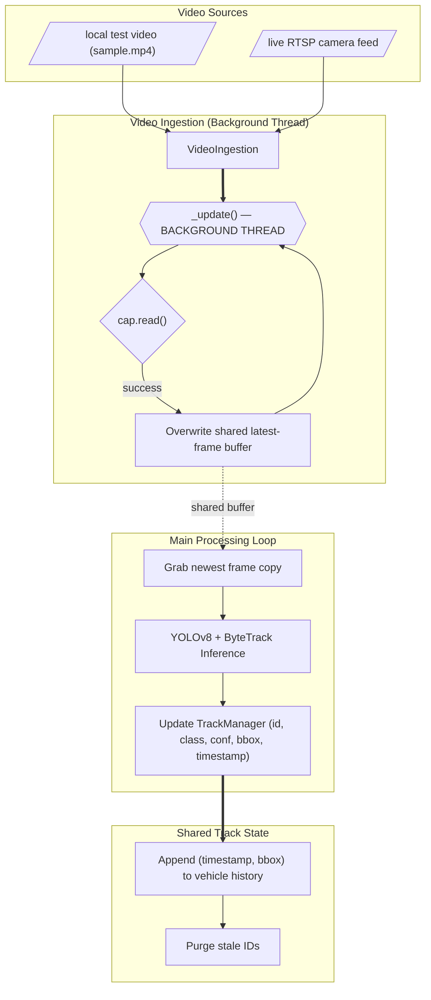
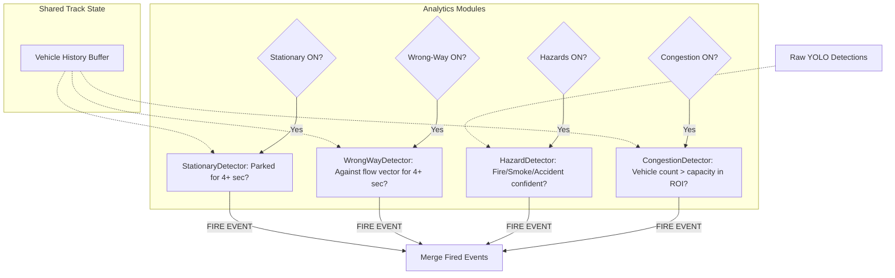
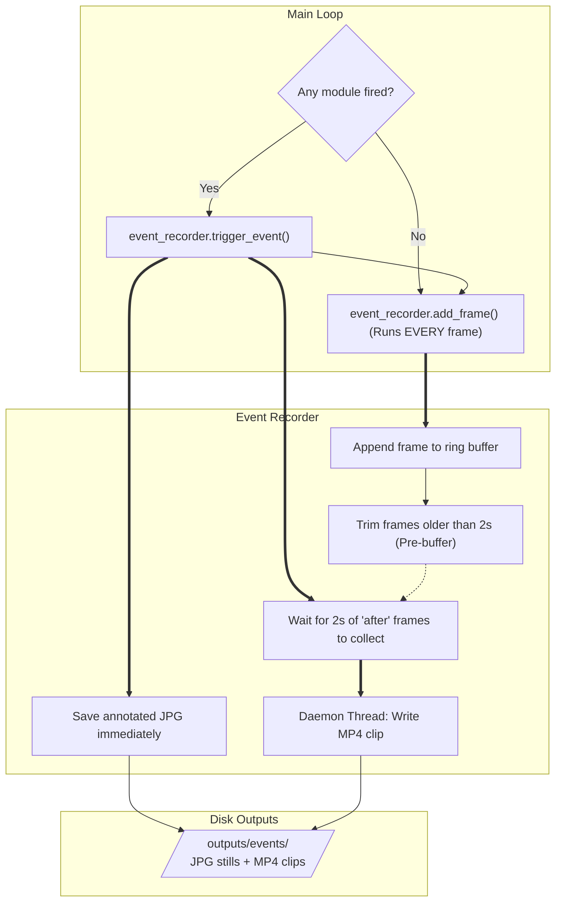
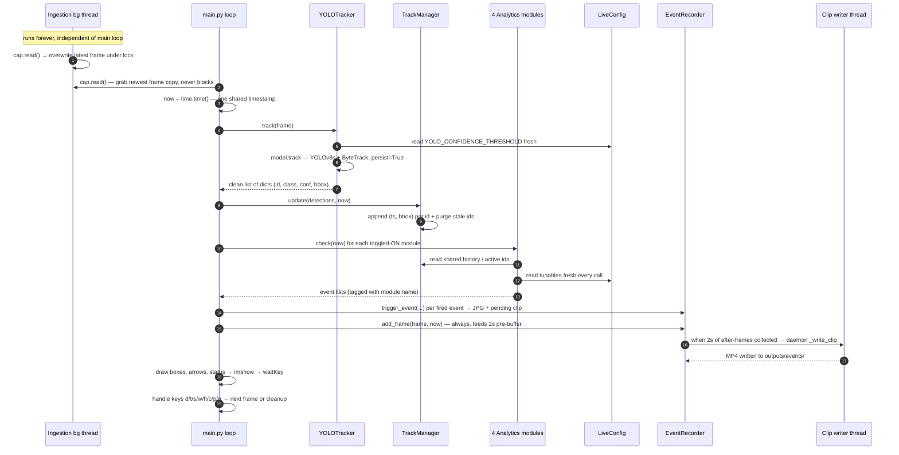

# Traffic Analysis YOLO Project — Architecture & Flowcharts

This document breaks down the system architecture of the real-time YOLOv8 traffic monitoring pipeline. To make the complex system easier to understand, the architecture is presented piece-by-piece, building up to the complete master flowchart at the end.

---

## 1. Data Ingestion & Tracking Pipeline
The system starts by ingesting video frames (either from a local file or a live RTSP stream) in a background thread to prevent blocking. The YOLOv8 model processes these frames, and ByteTrack assigns IDs to detections. A shared `TrackManager` maintains the history of each vehicle.

---

## 2. Analytics Modules
Once the `TrackManager` is updated, the pipeline passes the data to four independent analytics modules. Each module is responsible for detecting a specific traffic condition. Three modules rely on the `TrackManager`'s vehicle history, while the Hazard module relies on raw frame detections.

---

## 3. Event Recorder & Output
When any analytics module fires an event, the system immediately records it. A rolling pre-event buffer ensures we always have the 2 seconds of video *before* the event occurred, and a background thread writes the resulting `.mp4` clip and `.jpg` image to disk.

---

## 4. Master Flowchart (Complete System Architecture)
This is the complete, hyper-detailed architecture map of the whole pipeline in a single view:
`ingestion → YOLOv8s+ByteTrack tracker → shared TrackManager → 4 analytics modules → threaded event_recorder → OpenCV display`, plus the live-tuning system (`LiveConfig` + `TuningPanel`), the config layer, and the offline zone-calibration tool.

```mermaid
flowchart TD

%% ═════════════════════ EXTERNAL WORLD ═════════════════════
subgraph EXT["EXTERNAL INPUTS and OUTPUTS"]
direction LR
    X_FILE[/"data/test_footage/sample.mp4<br>local test video"/]
    X_RTSP[/"rtsp://127.0.0.1:8554/mystream<br>live RTSP camera feed"/]
    X_WEIGHTS[/"models/weights/new_best.pt<br>custom YOLOv8s 10-class weights<br>trained at imgsz 960"/]
    X_USER(["USER KEYBOARD<br>d t s w h c p q"])
    X_WIN[/"OpenCV HighGUI windows<br>Traffic Dashboard + Tuning Panel"/]
    X_OUT[/"outputs/events/<br>JPG stills + MP4 clips"/]
end

%% ═════════════════════ CONFIG LAYER ═════════════════════
subgraph CFG["config/ — CONFIGURATION LAYER"]
direction TB
    subgraph CFG_TH["config/thresholds.py — frozen startup constants"]
    direction TB
        CFG_YOLO["MODEL_IMGSZ = 960<br>YOLO_CONFIDENCE_THRESHOLD = 0.4"]
        CFG_ING["DEFAULT_FPS = 25<br>RECONNECT_MAX_RETRIES = 5<br>RECONNECT_DELAY_SEC = 1"]
        CFG_TRK["TRACK_BUFFER_FRAMES = 30"]
        CFG_STA["STATIONARY_DURATION_SEC = 5<br>STATIONARY_PIXEL_THRESHOLD = 15<br>STATIONARY_AREA_CHANGE_THRESHOLD = 0.25"]
        CFG_WW["WRONG_WAY_DURATION_SEC = 5<br>WRONG_WAY_SMOOTHING_WINDOW = 10<br>WRONG_WAY_COSINE_THRESHOLD = -0.3<br>WRONG_WAY_ZONES 2 polygons + flow vectors<br>WRONG_WAY_DEFAULT_FLOW_VECTOR"]
        CFG_HAZ["HAZARD_CONFIDENCE_THRESHOLD = 0.25<br>HAZARD_PERSISTENCE_SEC = 1<br>flicker rule: 3 confident of last 5 frames"]
        CFG_CON["CONGESTION_CAPACITY = 5<br>CONGESTION_ROI_POLYGON_NORM"]
        CFG_EVT["PRE_EVENT_SEC = 2, POST_EVENT_SEC = 2<br>EVENT_COOLDOWN_SEC = 2<br>HAZARD_EVENT_COOLDOWN_SEC = 30"]
        CFG_TAX["taxonomy — VEHICLE_CLASSES Car Bike Bus Truck<br>HAZARD_CLASSES Fire Smoke Accident<br>DETECTION_ONLY_CLASSES Animal Obj_On_Road<br>DEBUG flag"]
    end
    CFG_LC["config/live_config.py — class LiveConfig<br>init seeds 9 mutable thresholds from thresholds.py<br>ONE shared instance read FRESH every frame<br>snapshot returns dict of current values"]
end

%% ═════════════════════ MAIN ═════════════════════
subgraph MAIN["main.py — ENTRY POINT and REAL-TIME LOOP"]
direction TB

    subgraph MAIN_SU["startup — pieces 0 to 2"]
    direction TB
        M_START(["python main.py → main()"])
        M_INPUT["input prompt: type file or live"]
        M_CHOICE{"source_choice == live?"}
        M_SRC_LIVE["SOURCE = rtsp URL"]
        M_SRC_FILE["SOURCE = sample.mp4"]
        M_CFG["PIECE 0: config = LiveConfig()<br>ONE shared instance for everything"]
        M_CAP["PIECE 1: cap = VideoIngestion(SOURCE).start()<br>background reader thread begins"]
        M_TRK["tracker = YOLOTracker(WEIGHTS, config)<br>model fully loaded at init"]
        M_TM["track_manager = TrackManager()<br>single source of truth for track state"]
        M_PRIME{"prime loop: first_frame = cap.read()<br>still None?"}
        M_SLEEP["time.sleep 0.05 — do not spin CPU"]
        M_DIMS["frame_height, frame_width = first_frame.shape"]
        M_SD["stationary_detector =<br>StationaryDetector(track_manager, config)"]
        M_WD["wrong_way_detector =<br>WrongWayDetector(track_manager, config, w, h)"]
        M_HD["hazard_detector = HazardDetector(config)<br>NO track_manager — raw detections only"]
        M_CD["congestion_detector =<br>CongestionDetector(track_manager, w, h, config)"]
        M_ER["event_recorder = EventRecorder()"]
        M_WINSET["PIECE 2: namedWindow Traffic Dashboard 320x80<br>module_state all ON<br>dashboard_visible = False, panel_visible = False"]
    end

    subgraph MAIN_LOOP["pieces 3 to 7 — while True real-time loop"]
    direction TB
        M_LOOP{{"TOP OF LOOP — every frame"}}
        M_READ["frame = cap.read()<br>never blocks"]
        M_NONE{"frame is None?"}
        M_NOW["PIECE 4: now = time.time()<br>ONE shared timestamp per frame"]
        M_TRACK["detections = tracker.track(frame)"]
        M_TMUPD["track_manager.update(detections, now)"]
        M_INIT_EV["PIECE 5: all 4 event lists start as empty list<br>so OFF looks identical to fired-nothing"]
        M_GATE_S{"module_state stationary ON?"}
        M_CALL_S["stationary_events = stationary_detector.check(now)<br>tag each event module = stationary"]
        M_GATE_W{"module_state wrong_way ON?"}
        M_CALL_W["wrong_way_events = wrong_way_detector.check(now)<br>tag module = wrong_way"]
        M_GATE_H{"module_state hazards ON?"}
        M_CALL_H["hazard_events = hazard_detector.check(detections, now)<br>only module fed RAW detections<br>tag module = hazard"]
        M_GATE_C{"module_state congestion ON?"}
        M_CALL_C["congestion_events = congestion_detector.check(now)<br>tag module = congestion"]
        M_MERGE["PIECE 6: all_events = concat of the 4 lists"]
        M_ANYEV{"for each fired event"}
        M_TRIGGER["event_recorder.trigger_event<br>frame, now, event_type = module, metadata = event"]
        M_ADDF["event_recorder.add_frame(frame, now)<br>EVERY frame — feeds the rolling pre-event tape"]
        M_DRAW["PIECE 7: draw green bbox + label per detection<br>yellow motion arrow from history minus-5 centroid<br>status text overlay S W H C D T"]
        M_SHOWQ{"dashboard_visible?"}
        M_RESIZE["resize_frame_for_display max 1280x720<br>cv2.imshow"]
        M_KEY["key = cv2.waitKey(1) — 1ms pause,<br>repaints window, captures keypress"]
        M_QUITQ{"should_quit? q pressed<br>or window closed"}
        M_KEYS{"dispatch other keys"}
        M_K_TOG["s w h c → toggle_module_state<br>flips that module ON or OFF"]
        M_K_P["p → print_tuning_snapshot(config)<br>paste-ready dump for thresholds.py"]
        M_K_D["d → toggle dashboard visibility<br>resize window 1280x720 or 320x80"]
        M_K_T["t → create TuningPanel(config)<br>or destroy panel window"]
        M_CLEAN["CLEANUP: cap.stop()<br>cv2.destroyAllWindows()"]
        M_END(["program exit"])
    end
end

%% ═════════════════════ INGESTION ═════════════════════
subgraph ING["src/ingestion.py — class VideoIngestion"]
direction TB
    I_INIT["init(source, loop_file = True)<br>detect is_rtsp / is_file,<br>frame = None, threading.Lock,<br>running = False, thread = None"]
    I_OPEN["_open_capture()<br>RTSP → force TCP transport + CAP_FFMPEG<br>file or webcam → plain VideoCapture<br>raises RuntimeError if not opened<br>file → compute per-frame interval from FPS"]
    I_START["start()<br>open capture, running = True,<br>spawn DAEMON thread running _update,<br>return self for chaining"]
    I_UPD{{"_update() — BACKGROUND THREAD<br>while running"}}
    I_RETQ{"ret, frame = cap.read()<br>success?"}
    I_LOCKW["with lock: self.frame = frame<br>overwrite shared latest-frame buffer"]
    I_READ["read() — consumer side, never blocks<br>with lock: return frame.copy()<br>returns None if running is False<br>no stale-frame serving after thread death"]
    I_STOP["stop()<br>running = False, thread.join(),<br>cap.release()"]
end

%% ═════════════════════ ANALYTICS ═════════════════════
subgraph ANA["src/analytics/ — THE FOUR ANALYTICS MODULES"]
direction TB

    subgraph STA["stationary.py — class StationaryDetector"]
    direction TB
        S_CHECK["check(timestamp) — once per frame"]
        S_FIRE["FIRE ONCE per incident<br>event id, class, bbox, timestamp<br>anchor current centroid + area"]
    end

    subgraph WW["wrong_way.py — class WrongWayDetector"]
    direction TB
        W_CHECK["check(timestamp)"]
        W_FIRE["FIRE event id, class, bbox,<br>timestamp, cosine"]
    end

    subgraph HAZ["hazards.py — class HazardDetector"]
    direction TB
        H_CHECK["check(detections, timestamp)<br>works on RAW per-frame detections"]
        H_FIRE["FIRE event class, confidence,<br>bbox, timestamp"]
    end

    subgraph CON["congestion.py — class CongestionDetector"]
    direction TB
        C_CHECK["check(timestamp)<br>pure per-frame SNAPSHOT — no persistence"]
        C_FIRE["FIRE event count, capacity, timestamp<br>is_congested = True"]
    end
end

%% ═════════════════════ EDGES — STARTUP ═════════════════════
M_START --> M_INPUT --> M_CHOICE
M_CHOICE -->|"live"| M_SRC_LIVE --> M_CFG
M_CHOICE -->|"file"| M_SRC_FILE --> M_CFG
M_CFG --> M_CAP --> M_TRK --> M_TM --> M_PRIME
M_PRIME -->|"yes — no frame yet"| M_SLEEP --> M_PRIME
M_PRIME -->|"no — got real frame"| M_DIMS
M_DIMS --> M_SD --> M_WD --> M_HD --> M_CD --> M_ER --> M_WINSET --> M_LOOP

M_CFG -.->|"creates"| CFG_LC
M_CAP ==>|"constructs + starts"| I_INIT
M_CAP ==> I_START
M_TRK ==>|"constructs"| T_INIT
X_WEIGHTS -->|"loaded into memory"| T_INIT

%% ═════════════════════ EDGES — THE FRAME LOOP ═════════════════════
M_LOOP --> M_READ
M_READ ==>|"calls"| I_READ
M_READ --> M_NONE
M_NONE -->|"yes — skip spin"| M_LOOP
M_NONE -->|"no"| M_NOW --> M_TRACK
M_TRACK ==>|"calls"| T_TRACK
T_RET ==>|"detections list"| M_TMUPD
M_TMUPD ==>|"calls"| TM_UPD
M_TMUPD --> M_INIT_EV --> M_GATE_S

M_GATE_S -->|"ON"| M_CALL_S --> M_GATE_W
M_GATE_S -->|"OFF"| M_GATE_W
M_GATE_W -->|"ON"| M_CALL_W --> M_GATE_H
M_GATE_W -->|"OFF"| M_GATE_H
M_GATE_H -->|"ON"| M_CALL_H --> M_GATE_C
M_GATE_H -->|"OFF"| M_GATE_C
M_GATE_C -->|"ON"| M_CALL_C --> M_MERGE
M_GATE_C -->|"OFF"| M_MERGE

M_CALL_S ==> S_CHECK
M_CALL_W ==> W_CHECK
M_CALL_H ==>|"passes RAW detections"| H_CHECK
M_CALL_C ==> C_CHECK
M_MERGE --> M_ANYEV

M_ANYEV -->|"each event"| M_TRIGGER
M_ANYEV -->|"none"| M_ADDF
M_TRIGGER --> M_ADDF
M_ADDF --> M_DRAW --> M_SHOWQ

M_SHOWQ -->|"yes"| M_RESIZE --> M_KEY
M_SHOWQ -->|"no — tiny control window only"| M_KEY
M_KEY --> M_QUITQ
M_QUITQ -->|"yes"| M_CLEAN --> M_END
M_QUITQ -->|"no"| M_KEYS

M_KEYS -->|"s w h c"| M_K_TOG --> M_LOOP
M_KEYS -->|"p"| M_K_P --> M_LOOP
M_KEYS -->|"d"| M_K_D --> M_LOOP
M_KEYS -->|"t"| M_K_T --> M_LOOP
M_KEYS -->|"no key"| M_LOOP

M_CLEAN ==> I_STOP
X_USER --> M_KEY
M_RESIZE --> X_WIN

%% ═════════════════════ STYLES ═════════════════════
classDef extC fill:#ECEFF1,stroke:#607D8B,color:#37474F,stroke-dasharray:4 3
classDef mainC fill:#FFF8E1,stroke:#F59E0B,stroke-width:2px,color:#7C2D12
classDef cfgC fill:#EDE9FE,stroke:#7C3AED,color:#4C1D95
classDef ingC fill:#DBEAFE,stroke:#2563EB,color:#1E3A8A
classDef trkC fill:#CCFBF1,stroke:#0D9488,color:#134E4A
classDef staC fill:#FFEDD5,stroke:#EA580C,color:#7C2D12
classDef wwC fill:#FEE2E2,stroke:#DC2626,color:#7F1D1D
classDef hazC fill:#FEF9C3,stroke:#CA8A04,color:#713F12
classDef conC fill:#DCFCE7,stroke:#16A34A,color:#14532D

class X_FILE,X_RTSP,X_WEIGHTS,X_USER,X_WIN,X_OUT extC
class M_START,M_INPUT,M_CHOICE,M_SRC_LIVE,M_SRC_FILE,M_CFG,M_CAP,M_TRK,M_TM,M_PRIME,M_SLEEP,M_DIMS,M_SD,M_WD,M_HD,M_CD,M_ER,M_WINSET,M_LOOP,M_READ,M_NONE,M_NOW,M_TRACK,M_TMUPD,M_INIT_EV,M_GATE_S,M_CALL_S,M_GATE_W,M_CALL_W,M_GATE_H,M_CALL_H,M_GATE_C,M_CALL_C,M_MERGE,M_ANYEV,M_TRIGGER,M_ADDF,M_DRAW,M_SHOWQ,M_RESIZE,M_KEY,M_QUITQ,M_KEYS,M_K_TOG,M_K_P,M_K_D,M_K_T,M_CLEAN,M_END mainC
class CFG_YOLO,CFG_ING,CFG_TRK,CFG_STA,CFG_WW,CFG_HAZ,CFG_CON,CFG_EVT,CFG_TAX,CFG_LC cfgC
class I_INIT,I_OPEN,I_START,I_UPD,I_RETQ,I_LOCKW,I_READ,I_STOP ingC
class S_CHECK,S_FIRE staC
class W_CHECK,W_FIRE wwC
class H_CHECK,H_FIRE hazC
class C_CHECK,C_FIRE conC
```

## 5. One-frame Lifecycle (Runtime Sequence)
Finally, here is the sequence diagram showing how the tracker, analytics modules, and event recorder interact across a single frame.

