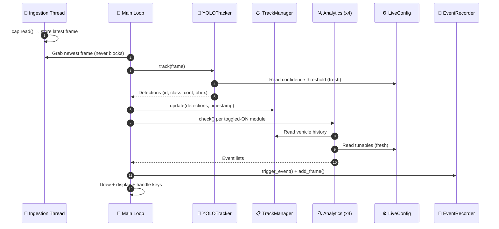

# Real-Time YOLOv8 Traffic Monitoring System

A real-time traffic monitoring pipeline built with a custom-trained 10-class YOLOv8s detector and ByteTrack. The system runs four independent analytics modules to detect real-world traffic conditions in real-time, automatically saving an annotated still image and a video clip whenever an event fires.

## 🚀 What It Does

The system detects **10 object classes**: Bus, Car, Bike, Person, Animal, Fire, Smoke, Accident, Obj_On_Road, Truck.

Those detections feed into four analytics modules:

| Module | Triggers when... |
|---|---|
| **Stationary Vehicle** | A vehicle stays parked/stopped for 4+ seconds. |
| **Wrong-Way** | A vehicle moves against the expected traffic direction for 4+ seconds. |
| **Hazard** | Fire, Smoke, or Accident is confidently detected and persists. |
| **Congestion** | Vehicle count in a monitored ROI polygon exceeds capacity. |

Every trigger saves an annotated still image **and** a short before/after video clip automatically — no manual review needed to catch an event.

## ⚙️ How It Works (Architecture)

The system is built on a highly modular, multi-threaded architecture to ensure zero dropped frames during real-time RTSP ingestion. The pipeline flows as follows:

`Ingestion → YOLOv8s+ByteTrack → TrackManager → Analytics Modules → Event Recorder`

> [!TIP]
> **Explore the Architecture Flowcharts!** 
> 
> The entire codebase has been mapped out using interactive Mermaid diagrams that build up piece-by-piece — from individual components to the complete system overview.
> 👉 **[View the Architecture Flowcharts here (PROJECT_FLOWCHART.md)](PROJECT_FLOWCHART.md)** *(GitHub supports native zooming and panning!)*

Below is a quick sequence diagram showing how the main loop processes a single frame:



## 🛠️ How to Run It

### Installation
```bash
pip install -r requirements.txt
```

### Running the Project
```bash
python main.py
```

### Step-by-Step: What Happens When You Run It

**1. Auto-Detection (no input required)**

The moment you run the script, it does a few things automatically in the background:
- **GPU Check:** It detects CUDA availability and prints `Running inference on: GPU` (or `CPU` if no GPU is found).
- **Source Check:** It silently pings the RTSP stream (`rtsp://127.0.0.1:8554/mystream`). If a live camera stream is available, it automatically connects to it. If it's offline, it instantly falls back to the `sample.mp4` test video without hanging.

**2. The Calibration Gate**

The script fetches the first frame of the video and pauses, prompting you in the terminal:
> `Have you already calibrated the zone/ROI polygons for this source? [y/n]:`

- **`y`** → Skips calibration entirely, keeping your existing zones from `config/thresholds.py`.
- **`n`** → Opens a window showing the camera feed where you can draw your congestion and wrong-way zones:
  - Click on the screen to draw polygon points.
  - Press `n` to finish a shape, and `s` when you are entirely done.
  - The terminal will ask the flow direction for each zone (type `left`, `right`, `up`, or `down`).
  - Finally, it asks: `Apply these calibrated values directly into config/thresholds.py now? [y/n]`. If you hit `y`, it automatically backs up the file and updates it for you — no manual copy-pasting required.

**3. Start Monitoring**

The script asks:
> `Start monitoring now? [y/n]:`

- **`y`** → The YOLO tracker and all four analytics engines spin up, and the main monitoring loop begins processing frames.
- **`n`** → The script exits cleanly.

**4. Using the Dashboard**

While the system is running, you'll see a message in the terminal:
> `Press 'd' to open the dashboard.`

- By default, the system runs **headless** (without displaying the video) to save resources and maximize FPS.
- Press `d` to open the live OpenCV dashboard showing bounding boxes, zones, and real-time analytics.
- Press `d` again to close it and return to background-only monitoring.

### Keyboard Controls

| Key | Effect |
|---|---|
| `d` | Show/hide the main video dashboard. |
| `t` | Show/hide the live tuning panel (developer tool — adjusts detection thresholds on the fly without restarting). |
| `s` | Toggle **Stationary** detection on/off. |
| `w` | Toggle **Wrong-Way** detection on/off. |
| `h` | Toggle **Hazard** detection on/off. |
| `c` | Toggle **Congestion** detection on/off. |
| `p` | Print current tuning values to the console. |
| `q` | Quit the application. |

### Outputs

Saved events land in the `outputs/events/` folder. Each event produces:
- A `.jpg` annotated still image.
- A `.mp4` clip containing 2 seconds before and 2 seconds after the event.

Files are named explicitly: `{module}_{class}_{id}_{timestamp}` (e.g., `stationary_Car_id3_182052_716.jpg`).

---

## 🏆 Achievements

| Metric | Value |
|---|---|
| **Final mAP50** | 0.721 |
| **Final mAP50-95** | 0.452 (best at epoch 66/100) |
| **Dataset Size** | 10,329 images, 65,741 annotations |
| **Top Class** | Obj_On_Road — 0.929 mAP50 |
| **Classes** | 10 (Bus, Car, Bike, Person, Animal, Fire, Smoke, Accident, Obj_On_Road, Truck) |
| **Training** | YOLOv8s at imgsz=960, Google Colab T4 GPU |

### Per-Class Breakdown

| Class | mAP50 | mAP50-95 |
|---|---:|---:|
| Obj_On_Road | 0.929 | 0.655 |
| Accident | 0.887 | 0.712 |
| Smoke | 0.859 | 0.547 |
| Animal | 0.801 | 0.462 |
| Car | 0.729 | 0.463 |
| Bus | 0.716 | 0.487 |
| Truck | 0.654 | 0.409 |
| Fire | 0.578 | 0.284 |
| Person | 0.554 | 0.267 |
| Bike | 0.506 | 0.237 |

---

## 🏗️ How It Was Built

The project began by deeply studying the YOLO architecture family (from v1 to v8) to understand grid-based detection, FPN merges, and IoU constraints. The **YOLOv8s** architecture was explicitly chosen for its backbone capacity to handle organic and cluttered hazard classes (Fire, Smoke, Accident) without sacrificing real-time speed.

**The Dataset Rebuild:**
Early on, the `Car` class suffered from heavy label contamination (trucks, taxis, and cars were merged into one label), resulting in a poor 0.485 mAP50. The entire dataset was rebuilt using VisDrone and Overhead Vehicle datasets, deliberately isolating a new `Truck` class to prevent confusion. This rebuild caused the `Car` class accuracy to jump from 0.485 → 0.729 mAP50.

**The Training Process:**
Training was performed in Google Colab (T4 GPU, 15GB VRAM) at `imgsz=960` to match the trained model's resolution. A strict checkpointing strategy (`patience=30`, `save_period=5`) was used to survive Colab's session limits over the 100-epoch run, with ~5 account switches across the full training saga.

> [!NOTE]  
> For the full, granular development history (including dead ends, specific bugs, and Roboflow metrics), read the **[HISTORY.md](HISTORY.md)** file.

---

## ⚠️ Limitations

- **Small Objects at Angles:** `Bike` (0.506 mAP50) and `Person` (0.554 mAP50) are the weakest classes — not a data-volume problem, but a domain-shift limitation. Small objects at elevated, overhead camera angles are significantly harder to detect than street-level imagery.
- **Domain-Shift Sensitivity:** Testing confirmed a generalization gap when moving from street-level training data to a handheld, elevated test camera. Bike dropped to ~0% and Person to ~3% on mismatched footage.
- **Manual Zone Calibration:** Wrong-way and congestion ROI polygons require calibration against the deployment camera's actual frame using the built-in calibration tool.

---

## 📁 Project Structure

```
Traffic_Analysis_YOLO_project/
├── main.py                          # Entry point — startup + real-time loop
├── config/
│   ├── thresholds.py                # Frozen startup constants (all tunables)
│   └── live_config.py               # LiveConfig — mutable thresholds read fresh each frame
├── src/
│   ├── ingestion.py                 # VideoIngestion — threaded frame reader
│   ├── tracker.py                   # YOLOTracker + TrackManager
│   ├── geometry.py                  # Shared polygon helpers (point-in-polygon, denormalize)
│   ├── event_recorder.py            # Rolling buffer + background MP4/JPG writer
│   ├── tuning_panel.py              # OpenCV trackbar panel for live threshold adjustment
│   └── analytics/
│       ├── stationary.py            # StationaryDetector
│       ├── wrong_way.py             # WrongWayDetector
│       ├── hazards.py               # HazardDetector (no TrackManager — raw detections)
│       └── congestion.py            # CongestionDetector
├── tools/
│   └── calibrate_zones.py           # Offline zone/ROI calibration tool
├── models/weights/                  # YOLOv8s trained weights (new_best.pt)
├── data/test_footage/               # Sample test video
├── outputs/events/                  # Saved JPG stills + MP4 clips
├── requirements.txt
├── PROJECT_FLOWCHART.md             # Interactive architecture diagrams
└── HISTORY.md                       # Full development journal
```

---

## 🧰 Tech Stack

| Component | Technology |
|---|---|
| **Detector** | YOLOv8s (Ultralytics) |
| **Tracker** | ByteTrack (raw, no wrapper libraries) |
| **Framework** | Python, OpenCV, PyTorch |
| **Training** | Google Colab (T4 GPU, 15GB VRAM) |
| **Dataset** | Roboflow (merged ~10 source datasets) |
| **Deployment** | Desktop OpenCV app (`cv2.imshow`) |
